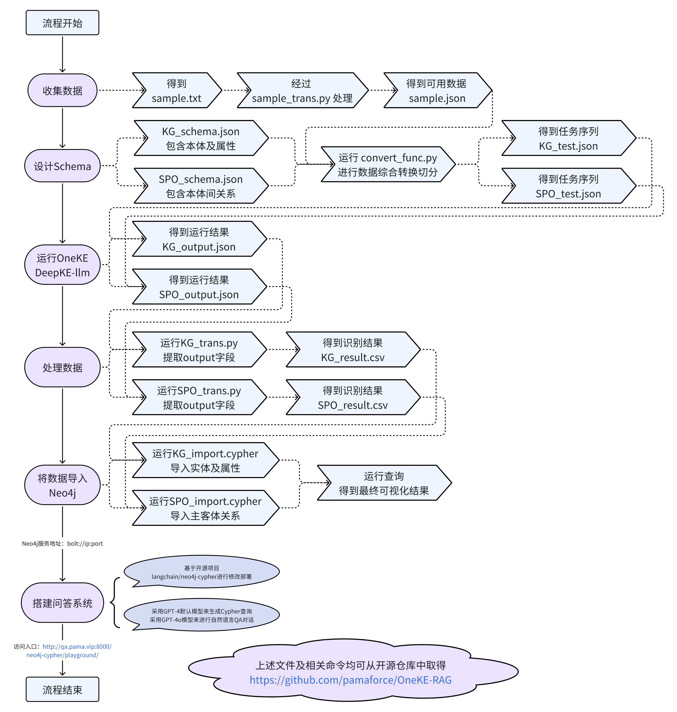
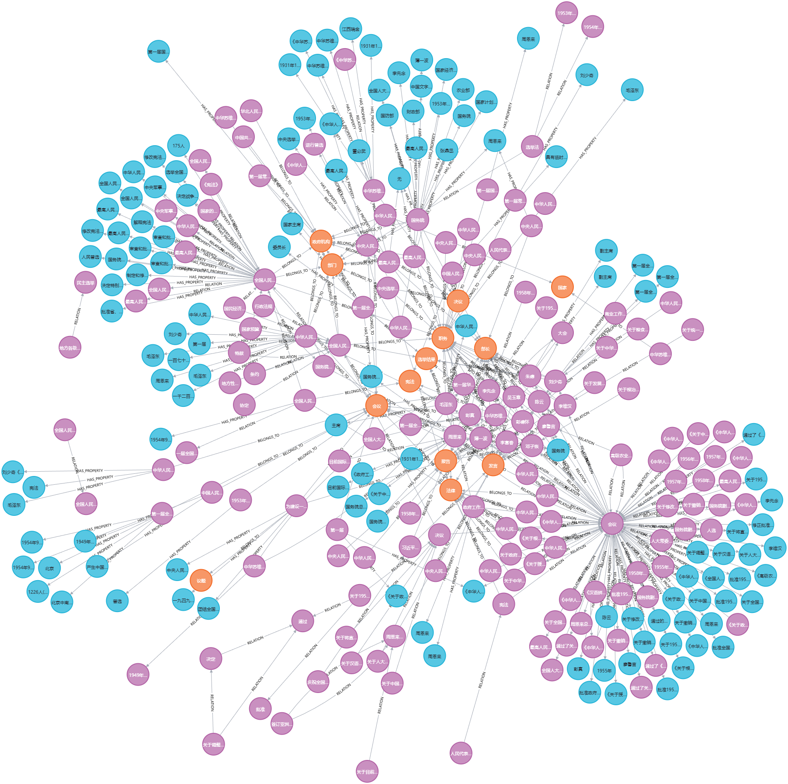
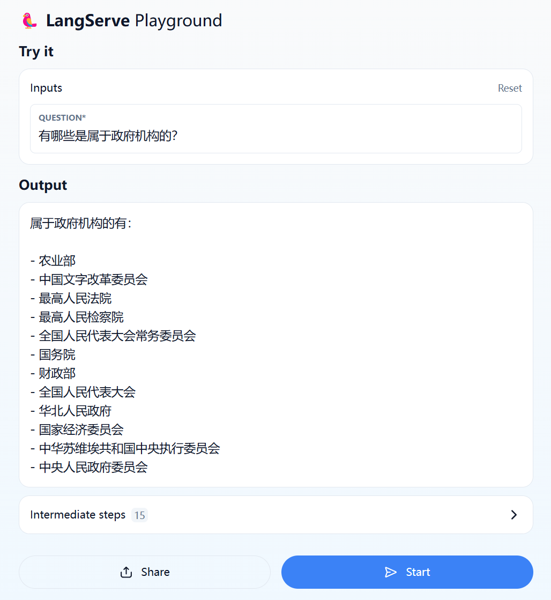
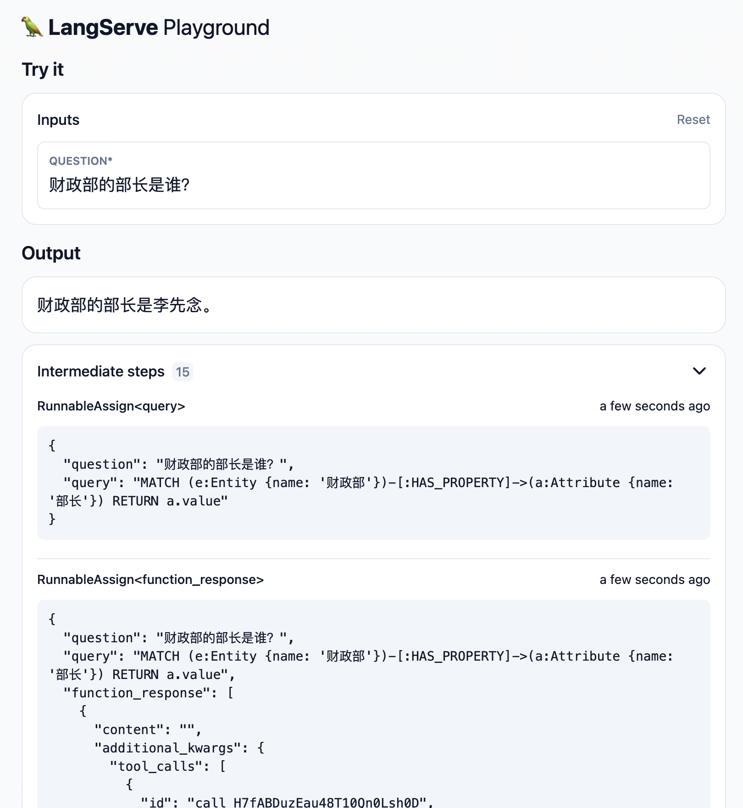
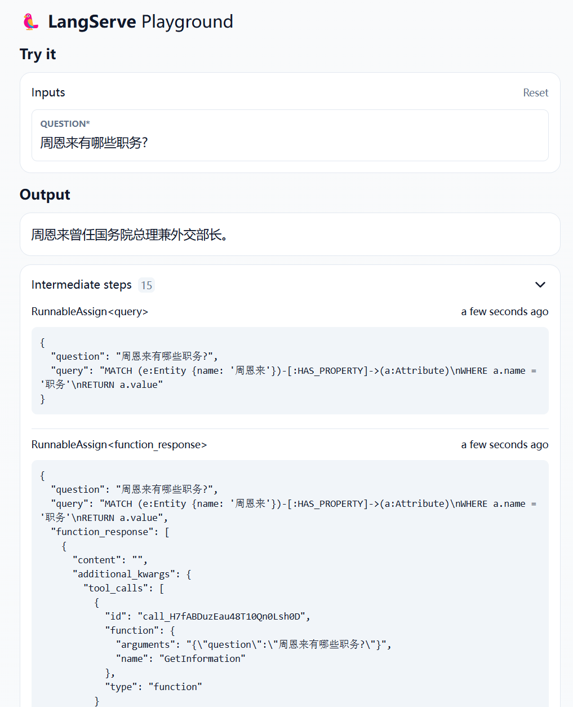
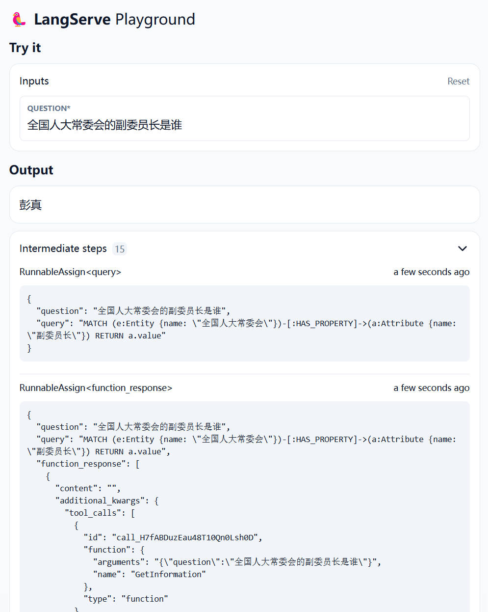

# 基于 OneKE 的知识图谱构建与 RAG 问答系统搭建

[问答系统体验地址](http://qa.pama.vip:8000/neo4j-cypher/playground/)

## 介绍
本仓库用于储存该项目中所涉及的一些脚本及中间结果文件，这个项目是知识工程课程实践的内容。

基于选题“第一次全国人民代表大会”来收集数据、构建知识图谱并搭建问答系统。

主要实现了设计知识图谱Schema、抽取实体及其关系、处理数据、构建知识图谱三元组关系、导入Neo4j进行可视化并搭建问答系统的整个流程。

相关技术方法有：OneKE模型的环境配置及使用、Python脚本对源数据及中间产物的处理、导入Neo4j所用Cypher语句的设计、langchain/neo4j-cypher自然语言转Cypher查询的RAG过程来进行问答并得到结果等。

过程记录文档：[Doc](https://rapr5wizcgi.feishu.cn/wiki/PV2UwBBANivVpCkVHtmccUWfnse)

  

  

  

  

## 许可证
这个仓库是在MIT许可证下发布的。详情请查看[LICENSE](LICENSE)文件。